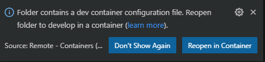
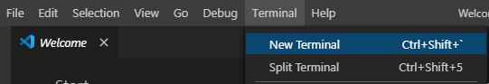
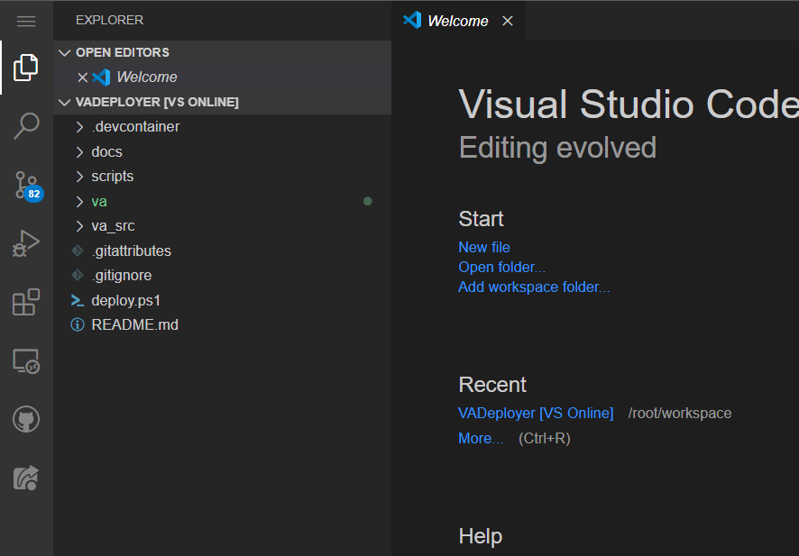

# Virtual Assistant Deployer Using VS Code

This document will walk you through how to deploy a Virtual Assistant only using VS Code and Docker on your local machine. 

## Things you need first 

1. An [Azure](https://azure.microsoft.com/) subscription 
2. [Visual Studio Code](https://code.visualstudio.com/)*
3. [Docker](https://www.docker.com/get-started)
5. Bot name – all lower case no spaces
6. A Bot password – 16 char, needs upper, lower and special chars

\* Visual Studio Code is not strictly required. You can follow the instructions below by creating the container yourself and using an interactive Docker session, but VS Code provides a simple way to automatically build, run, and attach to the container. It also allows for easy browsing, editing and updating of the deployed code.

## Install instructions

### Create the environment

1.	Clone https://github.com/microsoft/Virtual-Assistant-Deployer
2.	Open the cloned folder in Visual Studio Code 
3.	Click "Reopen in Container" when the below pop up appears in the bottom right corner of the screen. This step could take a couple of minutes. The output window at the bottom of the screen will notify you when everything is complete. 
   
   
   
   If this pop up doesn't appear, check to see if the "Remote - Container" extension is installed in VS Code.
   To see if the "Remote - Container" extension is insatlled:
   
      a. press Ctrl+Shift+X
      b. Search for "Remote - Container"
      c. Install the extension if it is not currently installed

4.	Create a new terminal in VS Code.



5. You will need to wait until all the projects are loaded into your environment before continuing. The "va" project should be highlighted green. Your project should look like the picture below. 
  
   
   
### run the deploy scripts

1. Click the hamburger menu at the top left of the screen. Navigate to "Terminal" --> "New Terminal"

2. In the newly created terminal, log into Azure 
 ````
     az login
 ```` 
3. A new window should open. Follow instructions to login
    * the instructions give you a link and a code. Browse to the specified link and enter the code
    
4. [OPTIONAL] If you have multiple subscriptions, you can set which subscription to use by running
 ````
     az account set -s "<subscription name or id>"
 ````
5. In the same terminal, run the deployment script and follow the prompts. 
  ````
 ./deploy.ps1
 ````
 
    * Name your bot
    * Choose the region
    * Create a password
    * Choose if you want to create a new LUIS Authoring Resource. If you choose "No" you will need to get your [Luis authoring key](https://www.luis.ai/user/settings) from your LUIS service. 
    * Choose your LUIS Authoring Region 
  (Note: It will take about 20 Minutes to deploy all of the Azure Resources)

6. The terminal will say "Deployment complete." when everything is deployed. 
 
## Testing it out
See the *How to talk to your assistant* section in the [README](https://github.com/microsoft/Virtual-Assistant-Deployer/tree/872d50adb57bafd4c036aa94c5e1d4f4d9c3174c#how-to-talk-to-your-assistant)
