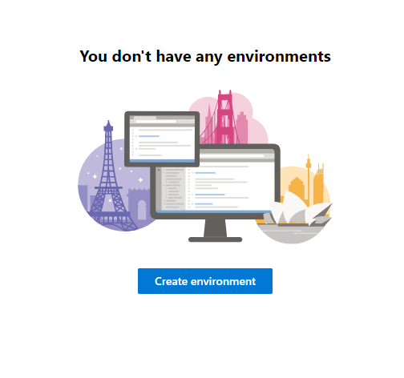
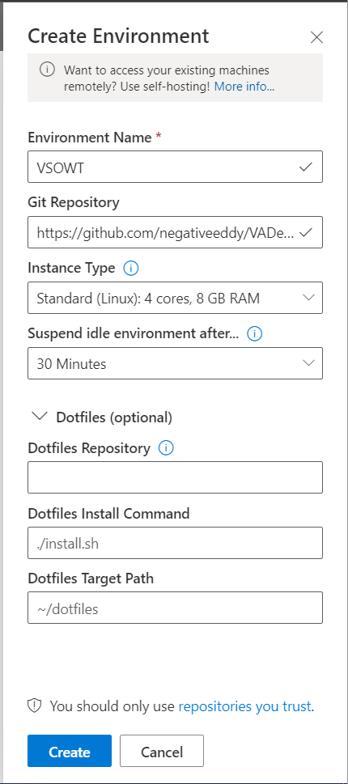

# Virtual Assistant Deployer Using Visual Studio Online 

This document will walk you through how to deploy a Virtual Assistant only using Visual Studio Online. 

## Things you need
1. An [Azure](https://azure.microsoft.com/) subscription 

## Deployment Instructions

### Create the environment

1. Go to [Visual Studio Online](https://online.visualstudio.com/login) and log in using your azure credentials. 
2. If you don't already have a Visual Studio Online plan, click the drop down at the top of the screen and select "Create new plan". Fill out the "Create a Billing Plan" blade that appears at the right of the screen. 
3. Once you have a plan, click the "Create environment" button at the center of the screen. (Note: if you already have VSO environments, this button will be located at the top right of the screen.)




4. A "Create Environment" blade will appear at the right of the screen.
    * Pick a Environment Name
    * In the "Git Repository" field, copy the URL of the VADeployer repo (https://github.com/negativeeddy/VADeployer)
    * For "Instance Type" the "Standard (Linux): 4 cores, 8 GB RAM" Sku will work just fine. 
    * Choose the 30 Minutes idle time (The deployment process takes ~15 minutes) 
    * You don't need to change the "Dotfiles"
  
  
  
  5. Click "Create". (Note: It will take about 5 Minutes for everything to spin up.)
  
  6. You will need to wait until all the projects are loaded into your environment before continuing. The "va" project should be highlighted green. Your project should look like the picture below. 
  
   
  
  ### Run the deploy scripts

  1. Click the hamburger menu at the top left of the screen. Navigate to "Terminal" --> "New Terminal"

  2. In the newly created terminal, log into Azure 
 ````
     az login
 ```` 
 3. A new window should open. Follow instructions to login
    * the instructions give you a link and a code. Browse to the specified link and enter the code
    
 4. [OPTIONAL] If you have multiple subscriptions, you can set which subscription to use by running
 ````
     az account set -s "<subscription name or id>"
 ````
 5. In the same terminal, run the deployment script and follow the prompts. 
  ````
 ./deploy.ps1
 ````
 
    * Name your bot
    * Choose the region
    * Create a password
    * Choose if you want to create a new LUIS Authoring Resource. If you choose "No" you will need to get your [Luis authoring key](https://www.luis.ai/user/settings) from your LUIS service. 
    * Choose your LUIS Authoring Region 
  (Note: It will take about 20 Minutes to deploy all of the Azure Resources)

 6. The terminal will say "Deployment complete." when everything is deployed. 
 
## Testing it out
See the *How to talk to your assistant* section in the [README](../readme.md)

